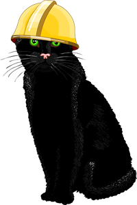

buddy
=====

Turn HTML content into an animating 3d book - also the name of the Story Time Island cat.

[](http://www.storytimeisland.com/cat.html)

[view an example](http://binocarlos.github.io/buddy)

## installation

### HTML

Download [build.css](https://raw.github.com/binocarlos/buddy/master/build/build.css) and [build.js](https://raw.github.com/binocarlos/buddy/master/build/build.js) and add them to your page.

```html
<link rel="stylesheet" href="build.css" />
<script src="build.js"></script>
```

### Component

To install buddy as a [component](https://github.com/component/component):

	$ component install binocarlos/buddy

## Usage

First you need some content that Buddy will turn into a book:

```html
<div id="book">
  <div class="page">
    Buddy likes fish.
  </div>
  <div class="page">
    Buddy likes humans when they give him fish.
  </div>
  <div class="page">
    Buddy thinks humans are stupid because they give him fish.
  </div>
</div>
```

Then - tell buddy about your book:

```js
var Buddy = require('buddy');
var book = new Buddy({
  selector:'#book',
  page_selector:'.page'
});
```

## Turning Pages

Buddy can handle touch events so users can turn pages - however, you can build galleries of thumbnails and manually trigger the page.

### animate_direction

This moves the book either forward or backwards by one page:

```js
var book = new Buddy(...);

// move the book forward one page
book.animate_direction(1)
```

### animate_index

This moves the book to a particular page:

```js
var book = new Buddy(...);

// send the book to page 6
book.animate_index(5)
```

## Complete Options

Buddy can handle a range of other options - here is an example:

```js
var Buddy = require('buddy');
var book = new Buddy({

  // the div that holds our pages
  selector:'#book',

  // the selector for our actual pages
  page_selector:'.page',

  // the element that responds to drag events to turn the page
  touch_selector:'body',

  // additional classname to apply to pages
  apply_pageclass:'bookpage',

  // control 3d mode (pages fade when disabled)
  is_3d:true,

  // how much to apply the 3d effect
  perspective:950,

  // control which page the book starts on
  startpage:0,

  // control whether a shadow is auto-rendered
  shadow:true

});
```

## Story Time Island - Cat Diary

If you like Buddy - checkout his [diary](http://www.storytimeisland.com/cat.html) at [Story Time Island!](http://www.storytimeisland.com)

[](http://www.storytimeisland.com)

## Licence

MIT